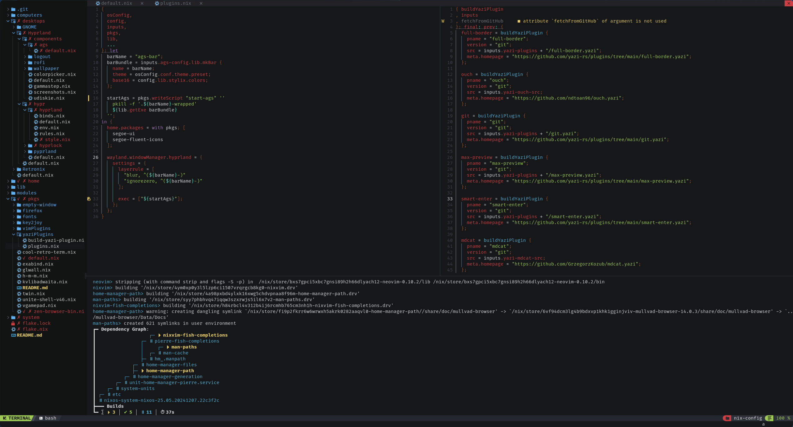

nixvim-config
=============
#### My Nixvim configuration

<div align="center"></div>

## Usage
### Run without installing
```Shell
nix run github:PierreBorine/nixvim-config
```

### Flake
Add this flake into your flake's inputs then access the package like this:
> [!NOTE]
> The input name (`nixvim-config` here) could be anything you want
```Nix
# flake.nix
{
  inputs.nixvim-config.url = "github:PierreBorine/nixvim-config";
}
```

```Nix
{inputs, pkgs, ...}: {
  # NixOS
  environment.systemPackages = [inputs.nixvim-config.packages.${pkgs.system}.default];
  # home-manager
  home.packages = [inputs.nixvim-config.packages.${pkgs.system}.default];
}
```

### Additional configuration
If you want to change some configs, you can use [`<nixvim>.extend`](https://nix-community.github.io/nixvim/platforms/standalone.html#extending-an-existing-configuration):
```Nix
# home-manager
{inputs, pkgs, config, ...}: let
  nvim' = inputs.nixvim-config.packages.${pkgs.system}.default;
  nvim = nvim'.extend {
    config.plugins.lsp.servers.nixd.settings = {
      options.nixos.expr = "(builtins.getFlake \"${config.home.homeDirectory}/nix-config\").nixosConfigurations.nixos.options";
    };
  };
in {
  home.packages = [nvim];
}
```
